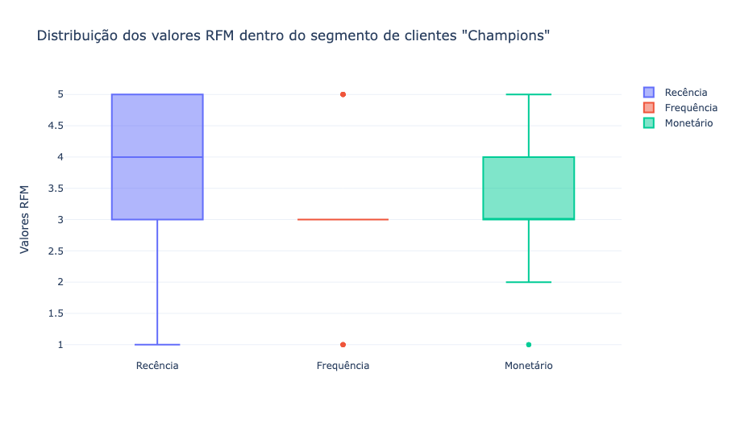

# AnaliseRFM.V1
Análise de segmentação de clientes usando a metodologia RFM.

## Recursos

- Implementação da metodologia RFM para calcular as pontuações de Recência, Frequência e Valor Monetário dos clientes.
- Análise exploratória dos dados para identificar padrões e tendências.
- Criação de segmentos de clientes com base nas pontuações RFM.
- Visualizações das informações obtidas.

## Demonstração
Nesse exemplo são criados três gráficos de caixa (box plots) que mostram a distribuição dos valores de Recência, Frequência e Valor Monetário (RFM) dentro do segmento de clientes "Champions".

